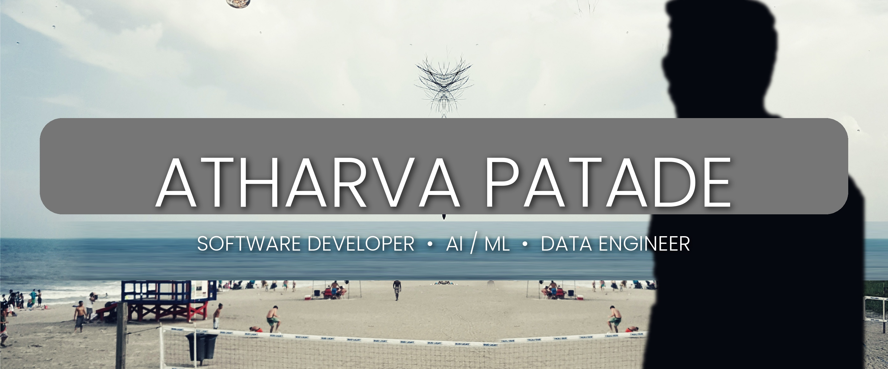

<h2>Hey there! I'm **Atharva**</h2>

### 👨🏻‍💻 &nbsp;About Me

💡 &nbsp;I'm a Software Developer with a strong interest in AI/ML and Data Engineering - I love building scalable systems and turning data into impact.\
🎓 &nbsp;I'm currently studying **Master in Information Science** at **California State University, Long Beach**. <!-- e.g. "B.Tech in Computer Science at Pune University" -->\
💼 &nbsp; Previously worked as a Software Engineer at Volkswagen Group Digital Solutions and Airtel Telecommunications.\
🌱 &nbsp;Currently going deeper into **Large Language Models, MLOps, and Distributed Data Systems**.\
✍️ &nbsp;In my free time, I work on side projects, contribute to open source, and write about ML / data infra.\
💬 &nbsp;Feel free to reach out for collaborations, mentorship, or just an interesting tech discussion.\
✉️ &nbsp;You can email me at **atharva.patade11@gmail.com** — I'll get back to you as soon as I can.

### 🛠 &nbsp;Tech Stack

**Languages**\
&nbsp;
&nbsp;
&nbsp;
&nbsp;
&nbsp;
&nbsp;

**AI / ML**\
&nbsp;
&nbsp;
&nbsp;
&nbsp;
&nbsp;
&nbsp;
&nbsp;

**Data Engineering**\
&nbsp;
&nbsp;
&nbsp;
&nbsp;
&nbsp;
&nbsp;
&nbsp;

**Cloud & DevOps**\
&nbsp;
&nbsp;
&nbsp;
&nbsp;
&nbsp;

**Web & Backend**\
&nbsp;
&nbsp;
&nbsp;
&nbsp;

**Tools**\
&nbsp;
&nbsp;
&nbsp;
&nbsp;

### 🤝🏻 &nbsp;Connect with Me

